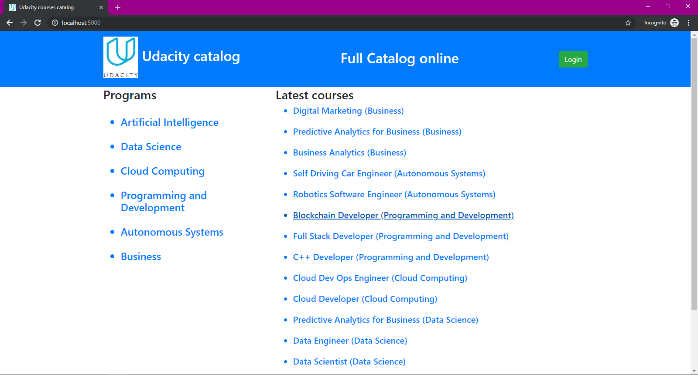
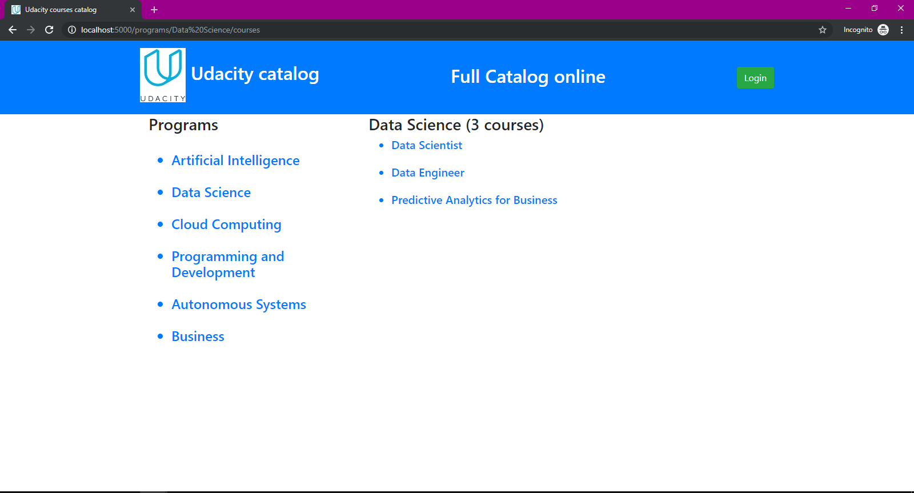
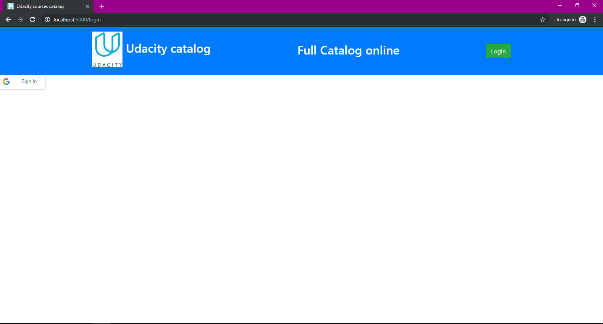
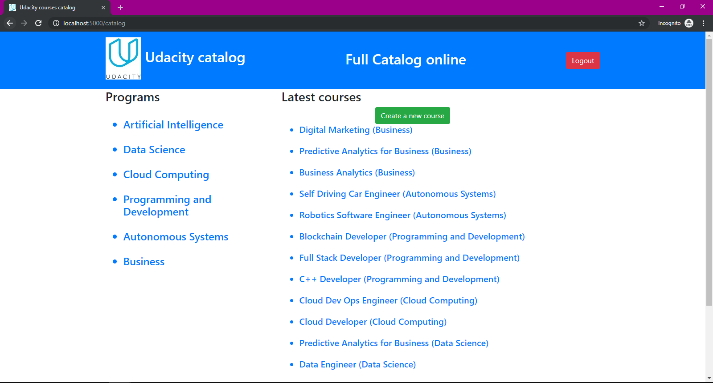
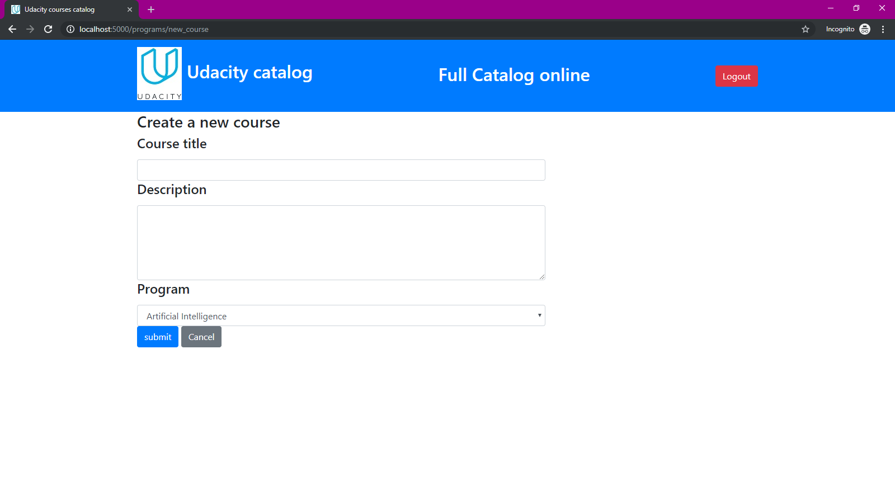
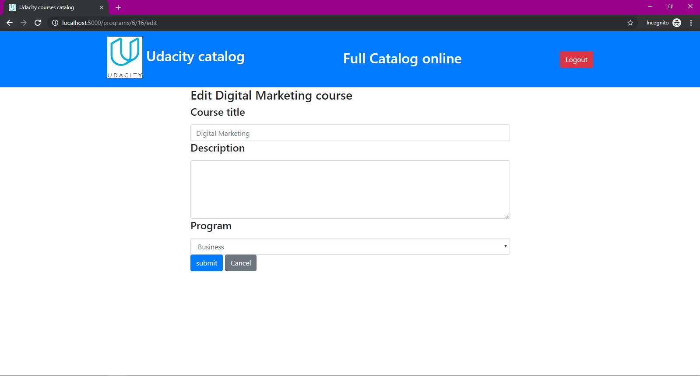
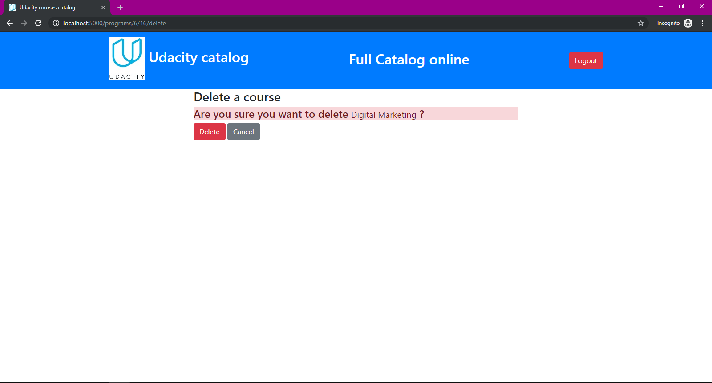
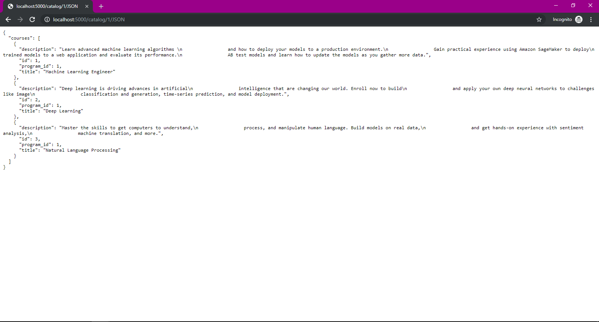
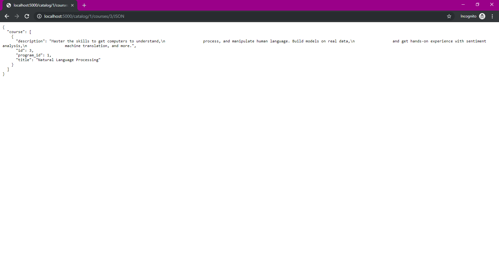

# Item Catalog project
**by  Sid Ali Mahmoudi**

## Description of Udacity Catalog project
This is the 4th udacity nanodegree project in the Full Stack track.
It consists of developping a RESTful web application that implements CRUD functions
(Create, Read, Update and Delete) using flask python library,SQLAlchemy as ORM 
(Object-Relational Mapping) and SQLite as SGBD. It provides also oauth2 using Google API.

The application allow the user to visualize Udacity programs and courses, see the courses ordered by
their date of creation, the courses of each program. He can authenticate using his gmail account.
After authenticating he can create new courses, update and delete the courses created by him, 
and he can loggout of course.

This catalog contains Udacity programs (id, title), and courses (id, title, description, program_id), 
such as each course belongs to only one program.

####   The Udacity Courses Catalog application  represents the Item Catalog 
## Project Structure

Within the download you'll find the following files:

```
item_catalog.zip/
├── static/
│   └── css/
│       └──styles.css
│
├── screenshots/
│   └── catalog_json.PNG
│   └── course_details.PNG
│   └── course_details_loggedin.PNG
│   └── course_json.PNG
│   └── create_new_course.PNG
│   └── delete_course.PNG
│   └── edit_course.PNG
│   └── login.PNG
│   └── program_courses.PNG
│   └── program_json.PNG
│   └── root_loggedin.PNG
│   └── root_page.PNG
│
├── templates/
│   └── all_programs.html
│   └── common.html
│   └── course.html
│   └── create_new_course.html
│   └── delete_course.html
│   └── edit_course.html
│   └── login.html
│   └── program_courses.html
│   
├── client_secrets.json
├── database_setup.py
├── inserting_elements.py
├── README.md
├── udacity_catalog.py
└── udacity_courses.db
```
## Requirements

-   [VirtualBox](https://www.virtualbox.org/)
-   [Vagrant](https://www.vagrantup.com/)
-   [Python 3.7](https://www.python.org/)
-   [sqlalchemy_utils](http://initd.org/psycopg/docs/install.html)  `pip install sqlalchemy_utils`
-   [Bash terminal(for windows machine)](https://git-scm.com/downloads)

## Installation

1.  Install Python 3.7 , VirtualBox and Vagrant
    
2.  Clone or download the Vagrant VM configuration file from  [fullstack-nanodegree-vm repository](https://github.com/udacity/fullstack-nanodegree-vm)
    
3.  Clone Or download this repository to your desktop , Unzip and  Paste all the files  from this project  `item_catalog` into the ```fullstack-nanodegree-vm-master\vagrant\catalog ``` sub-directory
    


## Steps to run this project

1.  Open terminal and go to the folder where you saved the fullstack repository then :  `cd vagrant`.
2.  Launch Vagrant to set up the virtual machine and then log into the virtual machine.:  `vagrant up`  then `vagrant ssh`
    
3. Then move inside the catalog folder:
`cd /vagrant/catalog`

4. Setup the database by running:
`python database_setup.py`

5. Insert some data into database if you want:
`python inserting_elements.py`

6. Then run the application:
`python udacity_catalog.py`

7. finally Access and test your application by visiting  [http://localhost:5000](http://localhost:5000/).:
`http://localhost:5000/`
   
You can modify the port number by modifying the port variable in `udacity_catalog.py`.
You may get some latency after login with you google account so please just wait half a second.
If you get some latency after clicking logout please click again on loggout button kindly.

## The expected program output is as the following : 

```http://localhost:5000/```, ```http://localhost:5000/catalog``` or ```http://localhost:5000/programs```
- Returns the root catalog page with all programs and recently added courses without login

 
 
 ```/catalog/<string:program_title>```
 ```/catalog/<string:program_title>/courses```
 ```/programs/<string:program_title>/courses```
```http://localhost:5000/catalog/Data%20Science/courses```
- Display courses of a specific program

  
  
```/catalog/<int:program_id>/<string:course_title>```
```http://localhost:5000/catalog/3/School%20of%20AI```
- Display information of a selected course


```http://localhost:5000/login```
- login with google api




```http://localhost:5000/catalog/new_course```
```/programs/new_course```
-  Create a new course after login



``` /catalog/<int:program_id>/<int:course_id>/edit```
```/programs/<int:program_id>/<int:course_id>/edit```
- Edit a course created by the current user



```/catalog/<int:program_id>/<int:course_id>/delete```
```/programs/<int:program_id>/<int:course_id>/delete```
- Delete a course created by the current user


## JSON Endpoints
```http://localhost:5000/catalog/JSON```
- JSON API to show Catalog information (all programs)


```/catalog/<int:program_id>/JSON```
```http://localhost:5000/catalog/3/JSON```
- JSON API to show program courses


```/catalog/<int:program_id>/courses/<int:course_id>/JSON```
```/programs/<int:program_id>/courses/<int:course_id>/JSON```
- JSON API to show  a specific course information



 ## Licence

The MIT License ([MIT](https://choosealicense.com/licenses/mit/#))
Copyright (c) [2019] [Sid Ali Mahmoudi]